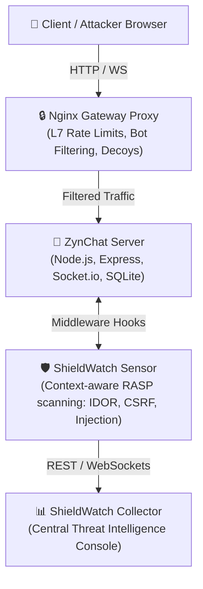

# ZynChat 💬
> **Secure Enterprise Messaging Platform & Security Hardening Benchmark**

[](#-configured-protection--vulnerability-profile)
[](https://nodejs.org/)
[](https://sqlite.org/)
[](#-system-architecture)

ZynChat is a modern, high-stakes real-time collaboration application designed for secure enterprise messaging. It serves as the official validation benchmark for the **ShieldWatch UADR (Unified Attack Detection & Response)** security appliance. 

The project demonstrates both common vulnerability profiles (OWASP Top 10) and active defense-in-depth mitigations utilizing edge-filtering proxies and **Runtime Application Self-Protection (RASP)**.

---

## 🏛️ System Architecture

ZynChat is deployed inside a multi-layered containerized security topology to enforce strict boundary controls and runtime inspection:



---

## 🛡️ Vulnerability Profile & Mitigation Matrix

ZynChat features two operational states: **Standard (Vulnerable Demo)** and **Secure (ShieldWatch RASP Hardened)**. This allows security teams to compare raw vulnerability behaviors against active mitigation signatures.

| Vulnerability Vector | Insecure Mode (Standard) | Hardened Mode (Secure) |
| :--- | :--- | :--- |
| **SQL Injection (SQLi)** | Concatenation in SQL query allows login bypass via `' OR 1=1 --`. | Parameterized SQLite queries + signature filtering blocks payload. |
| **Cross-Site Scripting (XSS)** | Message payloads are rendered unfiltered into the DOM. | Direct string scrubbing and HTML entities encoding. |
| **Path Traversal** | Access to `private/db_config.txt` via relative path traversal `../`. | Path resolve tracking and sandboxing restricted to the `uploads/` root. |
| **Command Injection** | Unsanitized inputs concatenated to system utilities (e.g. `ping`). | Regex validations strictly enforce DNS/IP host formats. |
| **IDOR / Object Access** | Access to user profiles via direct database IDs returns password hashes. | Verification guarantees session `userId` ownership before data release. |
| **Session Fixation** | Arbitrary session IDs can be planted into client cookies. | Dynamic session regeneration on authentication. |
| **CSRF** | State-changing JSON endpoints have no origin checks. | Double-submit CSRF token validation and Origin verification. |

---

## ⚙️ Quick Start & Installation

### 📋 Prerequisites
Ensure you have the following installed on your host system:
* **Node.js** (v18.0.0 or higher)
* **Python 3** (for the automated testing runner)
* **Nginx** (optional, required only for the gateway proxy layer validation)

---

### 🚀 Running Locally

#### Option A: Standard Start (Vulnerable Mode)
Run the application in its unmitigated state to inspect or test raw vulnerabilities:
```bash
npm install
npm start
```
> [!NOTE]
> The server will be exposed locally at **http://localhost:3001**.

#### Option B: Hardened Start (ShieldWatch Active)
Launch ZynChat alongside the active security suite and automated gateway proxying:
```bash
npm run start:secure
```

---

## 🧪 Security Simulation & Testing

ZynChat includes an automated security testing suite to validate WAF and RASP detection capabilities.

To launch simulated exploit payloads targeting ZynChat endpoints and print response status/telemetry registration results:

```bash
python3 attacks.py
```

> [!TIP]
> Run the simulation script under both **Standard** and **Hardened** modes to compare how the RASP sensor intercepts payloads in real-time.
